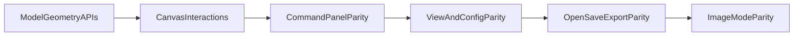

# SVG Path Editor Parity Plan

## Scope

Close remaining migration gaps between Angular source and React port, with execution ordered by dependency and user impact.

## Missing Features Snapshot (Current)

- **Canvas editing parity:** no drag-to-edit anchors/control points, no pan/gesture navigation, no hover/focus segment overlays.
- **Command panel parity:** missing row actions (insert/convert/delete), per-row command-type toggle, keyboard cell navigation parity.
- **View/config parity:** missing full `viewBox` manual controls + lock behavior, snap/ticks/fill/preview parity controls.
- **File workflows parity:** open/save path library and export dialog are not yet ported.
- **Image mode parity:** upload/import, image handles, opacity/aspect menu, and dedicated image-edit mode are not yet ported.

## Dependency Order

## Step-by-Step Implementation

### 1) Geometry and interaction foundation

- Extend path model to expose all editable geometry needed by canvas interactions (target points, control points, relation lines, movable flags).
- Add focused/hovered/dragging state and action atoms for canvas drag lifecycle and pan state.
- Primary files:
  - [src/svg-core/model.ts](src/svg-core/model.ts)
  - [src/store/0-atoms/2-svg-path-state.ts](src/store/0-atoms/2-svg-path-state.ts)

### 2) Canvas interaction parity

- Implement pointer drag for target/control points with precision/snap behavior parity.
- Implement canvas pan + wheel zoom (+ optional touch pinch parity) and selection clearing rules.
- Add hovered/focused segment overlay rendering and helper relation lines.
- Primary files:
  - [src/components/2-editor/3-canvas/2-canvas.tsx](src/components/2-editor/3-canvas/2-canvas.tsx)
  - [src/store/0-atoms/2-svg-path-state.ts](src/store/0-atoms/2-svg-path-state.ts)
  - [src/svg-core/model.ts](src/svg-core/model.ts)

### 3) Commands panel full parity

- Add command row menu/actions: insert-after, convert-to, delete, and guard rules (`canInsertAfter`, `canConvert`, `canDelete`).
- Add command token click toggle (relative/absolute) and keep canvas/row selection synchronized.
- Add keyboard navigation between numeric cells and global command editing shortcuts.
- Primary files:
  - [src/components/2-editor/2-props/3-editor-panels.tsx](src/components/2-editor/2-props/3-editor-panels.tsx)
  - [src/store/0-atoms/2-svg-path-state.ts](src/store/0-atoms/2-svg-path-state.ts)
  - [src/svg-core/model.ts](src/svg-core/model.ts)

### 4) View + configuration parity

- Add manual `viewBox` controls (`x/y/width/height`) with lock/unlock behavior.
- Add toggles for snap-to-grid, ticks + interval, fill, preview; ensure persistence in UI settings.
- Ensure zoom-fit/in/out controls match expected behavior.
- Primary files:
  - [src/components/1-toolbar/3-toolbar-view-settings-popover.tsx](src/components/1-toolbar/3-toolbar-view-settings-popover.tsx)
  - [src/store/1-ui-settings.ts](src/store/1-ui-settings.ts)
  - [src/components/2-editor/3-canvas/2-canvas.tsx](src/components/2-editor/3-canvas/2-canvas.tsx)

### 5) Open/Save/Export parity

- Port path storage library UX (named save/open/delete) on top of browser storage.
- Port export dialog/flow with style and `viewBox` options + SVG download.
- Primary files:
  - [src/components/2-editor/2-props/4-canvas-actions-menu.tsx](src/components/2-editor/2-props/4-canvas-actions-menu.tsx)
  - [src/store/0-atoms/2-svg-path-state.ts](src/store/0-atoms/2-svg-path-state.ts)
  - new components under [src/components](src/components)

### 6) Image editing mode parity

- Add image import mode and per-image selection state.
- Add on-canvas move/resize handles and context actions (opacity, aspect, delete).
- Wire mode switching interactions so path editing and image editing do not conflict.
- Primary files:
  - [src/components/2-editor/3-canvas/2-canvas.tsx](src/components/2-editor/3-canvas/2-canvas.tsx)
  - [src/store/1-ui-settings.ts](src/store/1-ui-settings.ts)
  - new image components/state under [src/components](src/components)

### 7) Parity QA and stabilization

- Run side-by-side behavior checks against Angular for each feature area.
- Add lightweight regression checks for parser/model/history and high-risk canvas interactions.
- Tighten history batching (avoid excessive per-keystroke history spam where needed).

## Done Definition Per Step

- Feature implemented in React with matching user-visible behavior.
- No type/lint/build failures.
- Short manual verification script captured for the step before moving to next one.

