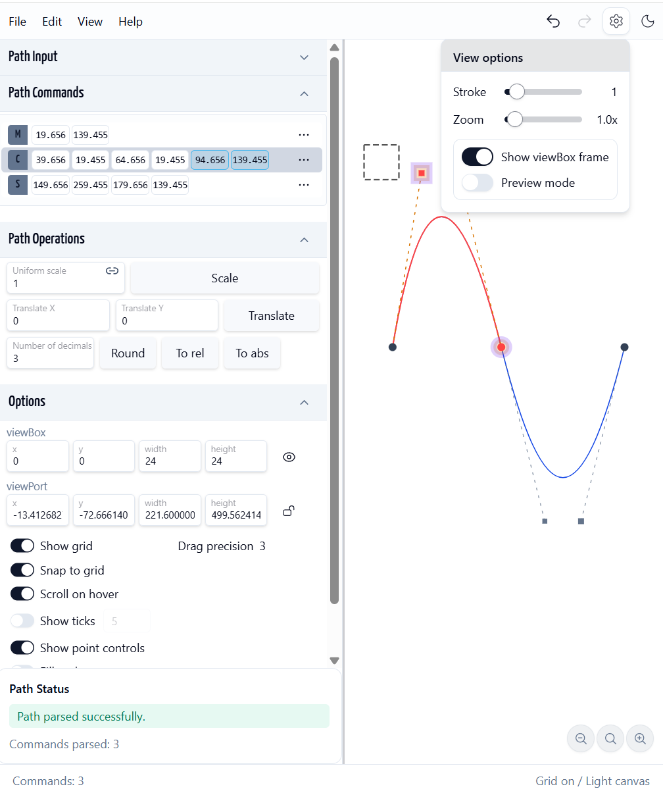

# svg-path26

SVG path viewer allows you to visualize and edit SVG path data interactively.

## References

##### More or less editors/viewers
- [SVG path exploration - svg-path first implementation - tm](https://github.com/maxzz/svg-path)
- [SVG Path Editor](https://yqnn.github.io/svg-path-editor)
- [SVG Path Visualizer](https://svg-path-visualizer.netlify.app)
- [paths: Edit SVG paths](https://github.com/jxnblk/paths)
- [svg-path-commander: A library for parsing and manipulating SVG path data](https://github.com/thednp/svg-path-commander)

##### Fonts
- [google-font-to-svg-path: Create an SVG path from a Google font](https://github.com/danmarshall/google-font-to-svg-path)
- [text-to-svg:Convert text to SVG path without native dependence.](https://github.com/shrhdk/text-to-svg)

##### Applications
- [svgpathtools: A collection of tools for manipulating and analyzing SVG path objects and Bézier curves](https://github.com/mathandy/svgpathtools)
- [svg-mesh-3d: Generate 3D meshes from SVG paths](https://github.com/mattdesl/svg-mesh-3d)
- [SVGMeshUnity - Generates mesh from SVG path in realtime for Unity](https://github.com/beinteractive/SVGMeshUnity)
- [svg-path-morph: Morph between two SVG paths](https://github.com/Minibrams/svg-path-morph)

##### Low level manipulation
- [paths-js: A JavaScript library for creating and manipulating paths](https://github.com/andreaferretti/paths-js)
- [svgpath: A library for transforming SVG path data](https://github.com/fontello/svgpath)
- [font_to_svg: Convert fonts to SVG paths (C++)](https://github.com/donbright/font_to_svg)
- [svg-path-bounding-box: Calculate the bounding box of an SVG path](https://github.com/icons8/svg-path-bounding-box)

##### Documentation
- [MDN - SVG Path Data](https://developer.mozilla.org/en-US/docs/Web/SVG/Tutorial/Paths)

## Run

- `pnpm install`
- `pnpm dev`
- `pnpm build`
